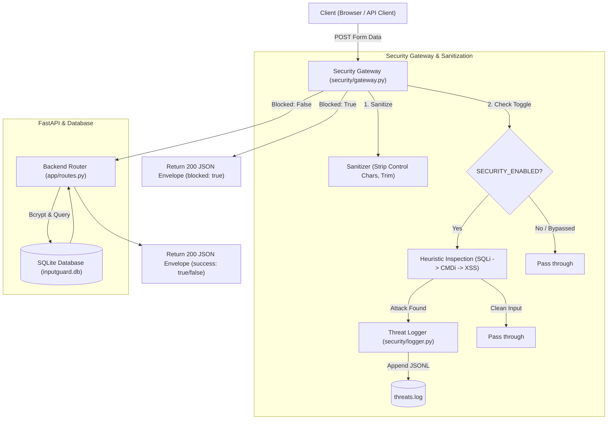

# 🛡️ InputGuard

**InputGuard** is a lightweight, signature-based **Security Gateway** and authentication web application built with **FastAPI**, **SQLite**, and **Jinja2**. It acts as a defensive middleware layer that intercepts, inspects, and sanitizes user input in real time—blocking common injection attacks (**SQL Injection**, **Cross-Site Scripting**, and **OS Command Injection**) before they reach backend logic or database queries, while maintaining a concurrent-safe audit log of all security events.

---

## 📑 Table of Contents

- [Features](#-features)
- [Architecture & Request Flow](#-architecture--request-flow)
- [Project Structure](#-project-structure)
- [API & Module Contracts](#-api--module-contracts)
  - [API Response Envelope](#api-response-envelope)
  - [Security Gateway Interface](#security-gateway-interface)
  - [Locked Endpoints](#locked-endpoints)
  - [Threat Log Schema](#threat-log-schema)
- [Configuration](#-configuration)
- [Getting Started](#-getting-started)
  - [Prerequisites](#prerequisites)
  - [Installation](#installation)
  - [Database Initialization](#database-initialization)
  - [Running the Development Server](#running-the-development-server)
- [Running Tests](#-running-tests)
- [Security Detection Details](#-security-detection-details)

---

## ✨ Features

- **Multi-Vector Threat Detection**:
  - **SQL Injection (SQLi)**: Detects tautologies (`' OR '1'='1'`), UNION-based attacks, inline/block comments (`--`, `/* */`), stacked queries (`; DROP TABLE`), and sleep/benchmark payloads.
  - **Cross-Site Scripting (XSS)**: Flags `<script>` tags, inline DOM event handlers (`onerror=`, `onload=`), `javascript:` pseudo-protocols, and `document.cookie` access.
  - **OS Command Injection (CMDi)**: Blocks shell metacharacter chaining (`;`, `|`, `&&`), command substitutions (`` `...` ``, `$(...)`), reverse shells, and invocation of system binaries (`cat /etc/passwd`, `whoami`, `powershell`).
- **Input Hygiene & ReDoS Mitigation**:
  - Strips NUL and ASCII control bytes, trims excess whitespace, and enforces field length limits.
  - Linear regex complexity and `MAX_SCAN_LENGTH` protection against Regular Expression Denial of Service (ReDoS).
- **Audit Logging**:
  - Thread-safe (`threading.Lock`) append-only JSONL logging (`threats.log`) capturing UTC timestamps (ISO 8601), attack types, client IP addresses, and raw attack payloads.
- **Secure Authentication**:
  - User registration and login with `bcrypt` password hashing (cost factor default) and unique username constraints.
- **Interactive Web Interface**:
  - Clean Jinja2 frontend pages (`/`, `/register`, `/dashboard`) with asynchronous JavaScript form handling and live threat log feeds.
- **Demo Mode Toggle**:
  - Toggle `SECURITY_ENABLED=False` to demonstrate unfiltered backend vulnerabilities vs. `SECURITY_ENABLED=True` for active defense.

---

## 🏛️ Architecture & Request Flow



---

## 📁 Project Structure

```
InputGuard/
├── app/                        # Backend Application (FastAPI)
│   ├── config.py               # Application settings (pydantic-settings)
│   ├── database.py             # SQLAlchemy engine & session factory
│   ├── main.py                 # FastAPI application root & static mounts
│   ├── models.py               # SQLAlchemy User model
│   ├── password_utils.py       # Bcrypt hash and verification helpers
│   └── routes.py               # Route controllers & API handlers
│
├── security/                   # Security Engine & Gateway
│   ├── __init__.py             # Package exports
│   ├── gateway.py              # Central process_request gateway
│   ├── logger.py               # Concurrency-safe JSONL threat logging
│   └── sanitizers.py           # Regex detection rules & input hygiene
│
├── frontend/                   # Frontend Templates & Assets
│   ├── assets/                 # Backgrounds & static illustrations
│   ├── css/
│   │   └── style.css           # UI styling & alert badges
│   ├── js/
│   │   └── app.js              # Client-side validation & AJAX handling
│   └── pages/                  # Jinja2 HTML templates
│       ├── base.html
│       ├── login.html
│       ├── register.html
│       └── dashboard.html
│
├── tests/                      # Automated Test Suite
│   ├── payloads.py             # Shared malicious & benign test payloads
│   └── test_backend.py         # Pytest API & integration tests
│
├── docs/                       # Project Documentation & Specifications
│   └── Rules.md                # Locked team contracts and architecture rules
│
├── db-schema.sql               # SQLite schema definition
├── requirements.txt            # Python dependencies
├── Dockerfile                  # Container definition
├── docker-compose.yml          # Container orchestration
└── README.md                   # Project documentation
```

---

## 🔌 API & Module Contracts

### API Response Envelope

All `/api/*` endpoints return a consistent JSON response envelope (except `/api/threat-log`):

```json
{
  "success": false,
  "blocked": true,
  "message": "Request blocked by InputGuard",
  "reason": "SQL Injection detected"
}
```

| Field | Type | Description |
|---|---|---|
| `success` | `boolean` | `true` if business action succeeded (e.g. login/registration). |
| `blocked` | `boolean` | `true` if the Security Gateway blocked the incoming payload. |
| `message` | `string` | Human-readable outcome message. |
| `reason` | `string \| null` | Description of the detected attack (`null` when `blocked` is `false`). |

---

### Security Gateway Interface

The backend invokes the security engine via `security.gateway.process_request`:

```python
from security.gateway import process_request

result = process_request(
    data={"username": "admin", "password": "' OR '1'='1"},
    ip="127.0.0.1"
)
```

**Return Contract:**
```python
{
    "sanitized_data": {"username": "admin", "password": "' OR '1'='1"},
    "is_blocked": True,
    "reason": "SQL Injection detected",
    "attack_type": "sqli"  # One of: "sqli", "xss", "cmdi", "none"
}
```

---

### Locked Endpoints

| Method | Path | Description | Response Type |
|---|---|---|---|
| `GET` | `/` | Login page view | `text/html` |
| `GET` | `/register` | Registration page view | `text/html` |
| `GET` | `/dashboard` | Dashboard & threat monitor view | `text/html` |
| `POST` | `/api/login` | Form authentication endpoint | JSON Envelope |
| `POST` | `/api/register` | User registration endpoint | JSON Envelope |
| `GET` | `/api/threat-log` | Returns logged threat entries | `{"threats": [...]}` |

---

### Threat Log Schema

Blocked threats are appended to `threats.log` as single-line JSON objects:

```json
{"timestamp": "2026-08-20T19:30:00", "attack_type": "sqli", "payload": "' OR '1'='1", "ip": "127.0.0.1"}
```

---

## ⚙️ Configuration

InputGuard is configured via environment variables or a `.env` file at the project root:

```ini
# Enable or disable active attack blocking (True/False)
SECURITY_ENABLED=True

# Database connection URL
DATABASE_URL=sqlite:///./inputguard.db

# Path to the threat audit log file
LOG_FILE=threats.log
```

---

## 🚀 Getting Started

### Prerequisites

- **Python 3.10+**
- **pip** and `venv`

### Installation

1. **Clone the repository:**
   ```bash
   git clone https://github.com/xhadi/InputGuard.git
   cd InputGuard
   ```

2. **Create and activate a virtual environment:**
   - **Windows (PowerShell):**
     ```powershell
     python -m venv .venv
     .venv\Scripts\Activate.ps1
     ```
   - **Linux / macOS:**
     ```bash
     python3 -m venv .venv
     source .venv/bin/activate
     ```

3. **Install dependencies:**
   ```bash
   pip install -r requirements.txt
   ```

### Database Initialization

Create the SQLite database table prior to launching the server:

- **Using Python:**
  ```bash
  python -c "from app.database import Base, engine; from app.models import User; Base.metadata.create_all(bind=engine)"
  ```
- **Or via SQLite CLI:**
  ```bash
  sqlite3 inputguard.db < db-schema.sql
  ```

### Running the Development Server

Start the application with Uvicorn:

```bash
uvicorn app.main:app --reload --host 127.0.0.1 --port 8000
```

Open your browser and navigate to:
- **Login:** [http://127.0.0.1:8000/](http://127.0.0.1:8000/)
- **Register:** [http://127.0.0.1:8000/register](http://127.0.0.1:8000/register)
- **Threat Dashboard:** [http://127.0.0.1:8000/dashboard](http://127.0.0.1:8000/dashboard)

---

## 🧪 Running Tests

Execute the automated test suite with `pytest`:

```bash
# Windows
.venv\Scripts\python.exe -m pytest tests/test_backend.py -v

# Linux / macOS
PYTHONPATH=. pytest tests/test_backend.py -v
```

### Test Coverage Highlights
- Endpoint HTML delivery for login, registration, and dashboard.
- Successful user registration and password bcrypt hashing validation.
- Duplicate username conflict handling.
- Valid login vs. invalid credentials check.
- Threat log parsing and retrieval.

---

## 🔍 Security Detection Details

| Attack Category | Key Detection Signatures & Techniques |
|---|---|
| **SQL Injection (`sqli`)** | Tautology regex matching (`OR 1=1`, `AND 'a'='a'`), string literal escape + boolean keyword (`' OR`), inline comments (`--`, `#`, `/* ... */`), UNION selects, stacked query execution (`; DROP`, `; DELETE`), DBMS routines (`xp_cmdshell`, `sleep()`, `benchmark()`, `sqlite_master`). |
| **Command Injection (`cmdi`)** | Backtick command execution (`` `cmd` ``), subshell evaluation (`$(cmd)`), piped or chained shell metacharacters (`;&|`) followed by standard binaries (`whoami`, `ls`, `cat`, `nc`, `powershell`, `cmd.exe`), path indicators (`/etc/passwd`, `system32`). |
| **Cross-Site Scripting (`xss`)** | `<script>` and `</script>` tags, inline HTML event attributes (`onerror=`, `onload=`, `onclick=`), `javascript:` pseudo-protocol URIs, DOM manipulation references (`document.cookie`, `eval()`, `data:text/html`). |
| **False-Positive Prevention** | Heuristics allow valid text with apostrophes (e.g., `"O'Brien"`), natural conjunctions (`"5 or 6 people"`), and standard password punctuation without command keywords (`"P@ssw0rd; keep it secret"`). |

---

## 📄 License

This project is developed for educational and security demonstration purposes.
